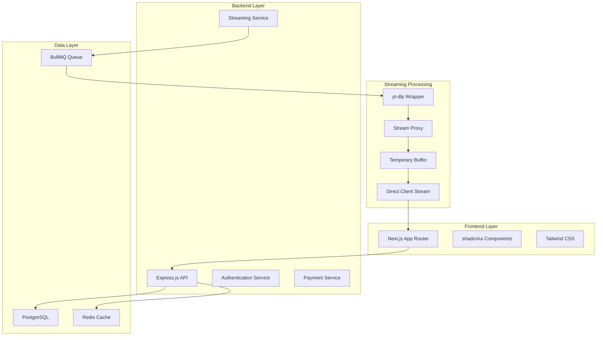
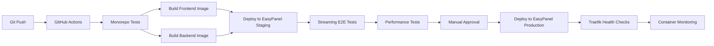

# KẾ HOẠCH PHÁT TRIỂN TOÀN DIỆN - TAIVIDEONHANH SAAS

## 📋 TỔNG QUAN DỰ ÁN

**Tên Dự Án:** TaiVideoNhanh SaaS Platform  
**Mục Tiêu:** Xây dựng wrapper SaaS xung quanh yt-dlp với web interface và business logic  
**Timeline:** 8 tuần (2 tháng)  
**Kiến Trúc:** Monorepo với Next.js + Node.js + PostgreSQL + Redis + yt-dlp core  
**Triển Khai:** EasyPanel + Docker + Traefik reverse proxy  
**Đặc Điểm Quan Trọng:** Streaming download - không lưu video vào server

## 🏗️ CẤU TRÚC MONOREPO

```
taivideonhanh/
├── frontend/          # Next.js 14 App Router
│   ├── src/
│   ├── public/
│   ├── package.json
│   └── Dockerfile
├── backend/           # Node.js Express API
│   ├── server.js
│   ├── package.json
│   └── Dockerfile
├── docker-compose.yml # Development environment
├── traefik/          # Reverse proxy configuration
│   ├── traefik.yml
│   └── dynamic_conf.yml
├── README.md
├── .gitignore
└── package.json      # Root workspace configuration
```

**Lợi ích Monorepo:**
- Quản lý phiên bản thống nhất
- Chia sẻ dependencies và utilities
- CI/CD pipeline đơn giản
- Triển khai đồng bộ trên EasyPanel

## 🎯 MÔ HÌNH KINH DOANH

### Gói Dịch Vụ
- **Free Tier:** Unlimited downloads, HD max quality, affiliate popup ads
- **Pro Tier:** 99k VND/tháng, highest quality, ad-free experience

### Đối Tượng Người Dùng
- Người dùng cá nhân cần tải video/audio offline
- Nhà sáng tạo nội dung và biên tập viên
- Nhà nghiên cứu và marketer

## 🏗️ KIẾN TRÚC HỆ THỐNG (STREAMING ARCHITECTURE)



### Streaming Download Architecture

**Luồng Streaming:**
1. User request video URL
2. yt-dlp extracts direct video URL
3. Server tạo streaming proxy
4. Video data được pipe trực tiếp từ source → server → client
5. Không lưu file vào disk, chỉ buffer nhỏ trong memory
6. Client nhận stream và tự động download

**Lợi Ích:**
- Tiết kiệm storage cost (không cần lưu file)
- Faster download (không cần wait for complete processing)
- Better scalability (không giới hạn bởi disk space)
- Reduced server load (no file cleanup needed)

## 📊 THIẾT KẾ CƠ SỞ DỮ LIỆU

### Bảng Chính (PostgreSQL)

```sql
-- Users Management
users (id, email, password_hash, subscription_tier, created_at, updated_at)
user_profiles (user_id, display_name, avatar_url, preferences)
refresh_tokens (id, user_id, token_hash, expires_at)

-- Subscription & Payments
subscription_plans (id, name, price, features, duration_days)
user_subscriptions (id, user_id, plan_id, status, starts_at, expires_at)
payments (id, user_id, amount, currency, status, payment_method, created_at)

-- Streaming Requests (Modified for streaming)
stream_requests (id, user_id, url, status, metadata, quality_requested, stream_token, created_at)
stream_sessions (id, user_id, stream_request_id, bytes_transferred, duration, completed_at)
supported_platforms (id, name, domain_pattern, extractor_name, is_active)

-- System & Analytics
system_settings (key, value, description, updated_at)
user_analytics (id, user_id, action, metadata, created_at)
affiliate_ads (id, title, content, target_url, is_active, display_frequency)
```

## 🚀 GIAI ĐOẠN PHÁT TRIỂN

### GIAI ĐOẠN 1: NỀN TẢNG & CORE (Tuần 1-2)

#### Tuần 1: Thiết Lập Dự Án & Authentication
**Mục tiêu:** Khởi tạo project structure và hệ thống xác thực

**Backend Tasks:**
- [ ] Thiết lập Express.js server với TypeScript (8h)
- [ ] Cấu hình PostgreSQL với Sequelize ORM (6h)
- [ ] Thiết lập Redis và BullMQ (4h)
- [ ] Xây dựng JWT authentication system (12h)
- [ ] API endpoints: POST /api/auth/register, /login, /refresh (8h)
- [ ] Middleware xác thực và phân quyền (6h)
- [ ] Database migrations cho users và auth tables (4h)

**Frontend Tasks:**
- [ ] Khởi tạo Next.js 14 với App Router (4h)
- [ ] Cấu hình shadcn/ui và Tailwind CSS (6h)
- [ ] Tạo layout components (Header, Footer, Sidebar) (8h)
- [ ] Xây dựng LoginForm và RegisterForm components (10h)
- [ ] Thiết lập authentication context và hooks (8h)
- [ ] Protected routes và middleware (6h)

**DevOps Tasks:**
- [ ] Docker configuration cho development với monorepo structure (6h)
- [ ] Traefik reverse proxy setup cho local development (4h)
- [ ] Environment variables setup cho cả frontend và backend (3h)
- [ ] ESLint và Prettier configuration cho workspace (3h)
- [ ] Docker Compose orchestration cho full stack (4h)

**Milestone 1:** Authentication system hoàn chỉnh với login/register

#### Tuần 2: Streaming Core & Video Analysis
**Mục tiêu:** Tích hợp yt-dlp và xây dựng streaming foundation

**Backend Tasks:**
- [ ] Tích hợp yt-dlp wrapper service với fallback extractors (14h)
- [ ] Xây dựng video metadata extraction (8h)
- [ ] **Streaming proxy service implementation với circuit breaker pattern (18h)**
- [ ] **Stream token generation và validation (8h)**
- [ ] API endpoint: POST /api/video/analyze (6h)
- [ ] **API endpoint: GET /api/stream/:token (streaming endpoint) (10h)**
- [ ] Queue system cho stream processing với BullMQ (10h)
- [ ] Error handling cho streaming failures với monitoring (10h)
- [ ] **Basic monitoring system cho extractor health (8h)**

**Frontend Tasks:**
- [ ] Video URL input component với validation (8h)
- [ ] Video information display component (10h)
- [ ] Quality selector component (6h)
- [ ] **Streaming download component với progress tracking (12h)**
- [ ] Basic dashboard layout (8h)

**Testing:**
- [ ] Unit tests cho streaming service (10h)
- [ ] Integration tests cho streaming endpoints (8h)

**Milestone 2:** Có thể analyze video và streaming download cơ bản

### GIAI ĐOẠN 2: STREAMING OPTIMIZATION & UI/UX (Tuần 3-4)

#### Tuần 3: Advanced Streaming & User Experience
**Mục tiêu:** Hoàn thiện hệ thống streaming và trải nghiệm người dùng

**Backend Tasks:**
- [ ] ~~**Adaptive bitrate streaming implementation (14h)**~~
- [ ] **CDN integration setup (CloudFlare/AWS CloudFront) (10h)**
- [ ] ~~**Resume download support cho interrupted streams (10h)**~~
- [ ] **Advanced connection pooling và load balancing (10h)**
- [ ] **Concurrent streaming limits và intelligent queue management (8h)**
- [ ] **Real-time streaming performance monitoring (10h)**
- [ ] **Bandwidth usage tracking và cost alerts system (8h)**
- [ ] Stream session tracking và user behavior analytics (10h)
- [ ] Rate limiting cho free users (streaming-based) (6h)
- [ ] **Enhanced memory management cho streaming buffers (8h)**

**Frontend Tasks:**
- [ ] **Advanced download interface với real-time streaming progress (14h)**
- [ ] ~~**Resume download functionality (8h)**~~
- [ ] ~~Stream history page (thay vì download history) (8h)~~
- [ ] ~~User dashboard với streaming statistics (10h)~~
- [ ] Responsive design optimization (8h)
- [ ] Loading states và error handling cho streams (8h)

**Quality Assurance:**
- [ ] **Streaming performance testing (8h)**
- [ ] Cross-browser streaming compatibility (6h)
- [ ] Mobile streaming optimization (6h)

**Milestone 3:** Hệ thống streaming hoàn chỉnh cho free users

#### Tuần 4: Subscription System Foundation
**Mục tiêu:** Xây dựng nền tảng cho hệ thống subscription

**Backend Tasks:**
- [ ] Subscription plans management API (8h)
- [ ] User subscription tracking (6h)
- [ ] **Middleware phân quyền streaming theo subscription (8h)**
- [ ] API endpoints cho subscription management (8h)
- [ ] Database migrations cho subscription tables (4h)

**Frontend Tasks:**
- [ ] Pricing page với plan comparison (10h)
- [ ] Subscription management trong user profile (8h)
- [ ] **Upgrade prompts cho free users (streaming limits) (8h)**
- [ ] Plan features display components (6h)

**Admin Foundation:**
- [ ] Basic admin panel structure (8h)
- [ ] Admin authentication và authorization (6h)

**Milestone 4:** Subscription system cơ bản sẵn sàng

### GIAI ĐOẠN 3: MONETIZATION & ADMIN (Tuần 5-6)

#### Tuần 5: Payment Integration & Legal Framework
**Mục tiêu:** Tích hợp thanh toán và xây dựng legal framework

**Backend Tasks:**
- [ ] Payment gateway integration (Stripe/PayPal) (12h)
- [ ] Webhook handling cho payment events (8h)
- [ ] Subscription lifecycle management (10h)
- [ ] **Comprehensive Terms of Service và Privacy Policy creation (8h)**
- [ ] **DMCA compliance system implementation (12h)**
- [ ] **User responsibility framework với content filtering (10h)**
- [ ] **Affiliate ads management system (streaming-aware) (10h)**
- [ ] **Ad display logic cho free users (pre-stream ads) (8h)**

**Frontend Tasks:**
- [ ] Payment form components (10h)
- [ ] Subscription upgrade flow (8h)
- [ ] **Terms of Service và Privacy Policy pages (8h)**
- [ ] **DMCA compliance user interface (6h)**
- [ ] **User responsibility guidelines display (4h)**
- [ ] **Affiliate popup implementation (pre-streaming) (10h)**
- [ ] Payment success/failure pages (6h)
- [ ] Billing history page (6h)

**Testing:**
- [ ] Payment flow testing (sandbox) (8h)
- [ ] Subscription upgrade/downgrade testing (6h)

**Milestone 5:** Payment system và affiliate ads hoạt động

#### Tuần 6: Admin Panel & Advanced Analytics
**Mục tiêu:** Hoàn thiện admin panel và comprehensive analytics

**Backend Tasks:**
- [ ] **Advanced admin dashboard APIs (streaming metrics, bandwidth, performance) (14h)**
- [ ] **Real-time streaming performance monitoring APIs (10h)**
- [ ] **Bandwidth cost tracking và alert system APIs (8h)**
- [ ] **User behavior analytics cho streaming patterns (12h)**
- [ ] User management APIs (view, edit, suspend) (8h)
- [ ] System settings management với streaming parameters (8h)
- [ ] **Enhanced streaming analytics data collection (10h)**
- [ ] **Platform health monitoring APIs (6h)**
- [ ] Supported platforms management (4h)

**Frontend Tasks:**
- [ ] **Advanced admin dashboard với real-time streaming metrics (16h)**
- [ ] **Bandwidth usage visualization và cost tracking dashboard (10h)**
- [ ] **User behavior analytics dashboard cho streaming patterns (12h)**
- [ ] **Real-time performance monitoring interface (10h)**
- [ ] User management interface với streaming history (12h)
- [ ] System settings panel với streaming configuration (10h)
- [ ] **Enhanced streaming analytics và reporting pages (12h)**
- [ ] **Platform health monitoring interface (8h)**
- [ ] Platform management interface (6h)

**Milestone 6:** Admin panel hoàn chỉnh với streaming management capabilities

### GIAI ĐOẠN 4: TESTING & DEPLOYMENT (Tuần 7-8)

#### Tuần 7: Comprehensive Testing & Optimization
**Mục tiêu:** Testing toàn diện và tối ưu hóa streaming

**Testing Tasks:**
- [ ] End-to-end streaming testing với Playwright (18h)
- [ ] **Load testing cho concurrent streaming (12h)**
- [ ] **Streaming performance optimization (10h)**
- [ ] Security testing và penetration testing (8h)
- [ ] User acceptance testing (UAT) (12h)
- [ ] **Memory leak testing cho streaming services (8h)**
- [ ] Bug fixes và refinements (16h)

**Documentation:**
- [ ] API documentation với Swagger (8h)
- [ ] **Streaming architecture documentation (6h)**
- [ ] User manual và FAQ (6h)
- [ ] Admin guide (4h)

**Milestone 7:** Hệ thống streaming stable và ready for production

#### Tuần 8: Production Deployment & Launch
**Mục tiêu:** Triển khai production và launch

**DevOps Tasks:**
**DevOps Tasks:**
- [ ] Production environment setup trên EasyPanel với monorepo deployment (14h)
- [ ] CI/CD pipeline configuration với GitHub Actions cho monorepo (8h)
- [ ] Database migration scripts và seeding (4h)
- [ ] SSL certificates và domain setup qua Traefik + Let's Encrypt (4h)
- [ ] Monitoring và logging setup cho Docker containers (10h)
- [ ] **Backup strategies implementation (metadata only) (4h)**
- [ ] EasyPanel service configuration cho frontend/backend containers (6h)

**Launch Preparation:**
- [ ] Final security audit (6h)
- [ ] **Streaming performance monitoring setup (6h)**
- [ ] Error tracking configuration (4h)
- [ ] Launch checklist completion (4h)

**Post-Launch:**
- [ ] **Streaming monitoring và hotfixes (10h)**
- [ ] User feedback collection (4h)

**Milestone 8:** Production launch thành công

## 📋 PHÂN TÍCH TÍNH NĂNG CHI TIẾT

### User-Facing Features

#### Authentication & User Management
- Đăng ký/đăng nhập với email/password
- Email verification
- Password reset functionality
- User profile management
- Subscription status display

#### Streaming Video Processing
- URL input với validation cho multiple platforms
- Video metadata display (title, duration, thumbnail)
- Quality/format selection
- **Real-time streaming download với progress**
- **Resume interrupted streams**
- **Concurrent streaming limits based on subscription**
- Stream history với search/filter

#### Subscription & Billing
- Plan comparison page (emphasizing streaming benefits)
- Secure payment processing
- Subscription management
- Billing history
- Automatic renewal handling

#### User Experience
- Responsive design cho mobile/desktop
- Real-time notifications
- **Direct streaming to device (no server storage)**
- Search trong stream history
- Export stream history

### Admin Panel Features

#### Dashboard & Analytics
- User statistics (total, active, new registrations)
- **Streaming statistics (concurrent streams, bandwidth usage)**
- Revenue analytics
- **System performance metrics (streaming-focused)**
- Real-time monitoring

#### User Management
- User list với search/filter
- User profile viewing/editing
- Subscription management
- Account suspension/activation
- Support ticket management

#### System Management
- Supported platforms configuration
- **System settings (concurrent stream limits, bandwidth limits)**
- Affiliate ads management
- Payment gateway configuration
- **Streaming performance monitoring**

## ⚠️ QUẢN LÝ RỦI RO (STREAMING-SPECIFIC)

### Rủi Ro Kỹ Thuật

1. **API Changes từ Video Platforms**
   - **Rủi ro:** YouTube, TikTok thay đổi API/structure
   - **Giảm thiểu:** 
     * Multiple video extractor fallback mechanisms (yt-dlp, youtube-dl, custom extractors)
     * Automated monitoring system cho yt-dlp updates và platform changes
     * Circuit breaker pattern cho streaming services khi detect failures
   - **Contingency:** Emergency manual extractor updates, platform-specific workarounds

2. **Streaming Performance Issues**
   - **Rủi ro:** High concurrent streams causing server overload
   - **Giảm thiểu:** 
     * Advanced connection pooling và load balancing strategy
     * Adaptive bitrate streaming implementation
     * CDN integration từ giai đoạn đầu (CloudFlare/AWS CloudFront)
   - **Contingency:** Auto-scaling containers, intelligent queue management

3. **Bandwidth Costs**
   - **Rủi ro:** High bandwidth usage với streaming architecture
   - **Giảm thiểu:** 
     * Real-time bandwidth usage tracking và cost alerts
     * Compression algorithms và adaptive streaming
     * User tier-based bandwidth limits
   - **Contingency:** Emergency bandwidth throttling, CDN cost optimization

4. **Memory Management**
   - **Rủi ro:** Memory leaks từ streaming buffers
   - **Giảm thiểu:** 
     * Advanced buffer cleanup mechanisms
     * Real-time memory monitoring và alerts
     * Automatic service restart khi detect memory issues
   - **Contingency:** Container memory limits, emergency cleanup procedures

### Rủi Ro Kinh Doanh

5. **Legal/Copyright Issues**
   - **Rủi ro:** Vấn đề bản quyền từ content creators
   - **Giảm thiểu:** 
     * Comprehensive Terms of Service và Privacy Policy
     * DMCA compliance system với automated takedown procedures
     * User responsibility framework với clear guidelines
   - **Contingency:** Legal consultation retainer, content filtering system

6. **Competition**
   - **Rủi ro:** Competitors với features tương tự
   - **Giảm thiểu:** Streaming architecture advantage, superior UX
   - **Contingency:** Feature differentiation, competitive pricing strategy

## 🧪 CHIẾN LƯỢC KIỂM THỬ (STREAMING-FOCUSED)

### Testing Pyramid

#### Unit Tests (40%)
- Streaming service testing
- Buffer management testing
- Component testing (React)
- Database model testing

#### Integration Tests (40%)
- Streaming API endpoint testing
- Database integration testing
- Third-party service integration
- Payment flow testing
- **Streaming pipeline testing**

#### End-to-End Tests (20%)
- **Complete streaming user journey testing**
- Cross-browser streaming testing
- Mobile streaming responsiveness testing
- **Concurrent streaming performance testing**

### Testing Tools
- **Backend:** Jest, Supertest
- **Frontend:** Jest, React Testing Library
- **E2E:** Playwright
- **Load Testing:** Artillery (streaming-specific scenarios)
- **Security:** OWASP ZAP

### Streaming-Specific Testing Scenarios
- Multiple concurrent streams
- Stream interruption and resume
- Different video qualities and formats
- Network condition variations
- Memory usage during long streams

## 🚀 KẾ HOẠCH TRIỂN KHAI (STREAMING-OPTIMIZED)

### Environment Strategy

#### Development (Monorepo)
- Local development với Docker Compose cho full stack
- Hot reload cho cả frontend và backend
- Shared utilities và types giữa frontend/backend
- Test databases và Redis instances
- **Local streaming testing environment với Traefik**

#### Staging (EasyPanel)
- Production-like environment trên EasyPanel
- Automated deployment từ staging branch
- Container orchestration với Docker
- Integration testing environment
- **Streaming performance testing với real containers**

#### Production (EasyPanel + Traefik)
- Triển khai trên VPS sử dụng EasyPanel
- Container management và auto-scaling
- Traefik reverse proxy với SSL termination
- Monitoring và logging cho tất cả containers
- **Optimized cho high-performance streaming**

### Deployment Pipeline (Monorepo)



**GitHub Actions Workflow:**
```yaml
name: Deploy Monorepo
on:
  push:
    branches: [main]

jobs:
  test:
    runs-on: ubuntu-latest
    steps:
      - uses: actions/checkout@v3
      - name: Test Frontend
        run: |
          cd frontend
          npm test
      - name: Test Backend
        run: |
          cd backend
          npm test
  
  deploy:
    needs: test
    runs-on: ubuntu-latest
    steps:
      - name: Build and Deploy to EasyPanel
        run: |
          docker build -t frontend ./frontend
          docker build -t backend ./backend
          # Deploy via EasyPanel API or webhook
```

### Infrastructure Requirements (Streaming-Optimized)

#### Minimum Production Setup (EasyPanel + Monorepo)

**Container Architecture:**
- **Frontend Container:** Next.js app (port 3000)
- **Backend Container:** Node.js API (port 5000)
- **Database:** PostgreSQL 14+ container với 8GB RAM
- **Cache:** Redis container với 4GB RAM
- **Reverse Proxy:** Traefik container (ports 80/443)

**EasyPanel Services:**
```yaml
# Frontend Service
frontend:
  image: taivideonhanh-frontend:latest
  environment:
    - NEXT_PUBLIC_API_URL=https://api.taivideonhanh.com
  
# Backend Service  
backend:
  image: taivideonhanh-backend:latest
  environment:
    - DATABASE_URL=postgresql://...
    - REDIS_URL=redis://...

# Traefik Configuration
traefik:
  labels:
    - "traefik.http.routers.frontend.rule=Host(`taivideonhanh.com`)"
    - "traefik.http.routers.api.rule=Host(`api.taivideonhanh.com`)"
```

**Infrastructure:**
- **Bandwidth:** High-speed connection với unlimited data
- **CDN:** CloudFlare hoặc AWS CloudFront (essential for streaming)
- **SSL:** Automatic Let's Encrypt via Traefik
- **Monitoring:** Docker container health checks

#### Streaming-Specific Requirements
- **Memory:** Sufficient RAM cho concurrent streaming buffers
- **Network:** Low latency, high bandwidth connection
- **CPU:** Adequate processing power cho real-time streaming
- **Monitoring:** Real-time bandwidth và performance monitoring

## 📈 CỘT MỐC QUAN TRỌNG

| Tuần | Milestone | Deliverables |
|------|-----------|--------------|
| 2 | Authentication + Streaming Core | Login system + Basic streaming |
| 4 | Advanced Streaming System | Full streaming functionality |
| 6 | Subscription + Admin Panel | Payment system + Streaming admin |
| 8 | Production Launch | Live streaming SaaS platform |

## 🔄 PHỤ THUỘC NHIỆM VỤ

### Critical Path
1. Database setup → Authentication → Streaming core
2. Streaming core → Advanced streaming → User interface
3. Subscription system → Payment integration → Admin panel
4. Testing → Deployment → Launch

### Parallel Development Tracks
- **Track 1:** Backend streaming API development
- **Track 2:** Frontend streaming UI/UX development  
- **Track 3:** DevOps và streaming infrastructure
- **Track 4:** Testing và QA (streaming-focused)

## 📊 ƯỚC TÍNH THỜI GIAN TỔNG (UPDATED FOR ENHANCED STREAMING)

| Giai Đoạn | Backend | Frontend | DevOps | Testing | Tổng |
|-----------|---------|----------|--------|---------|------|
| Giai đoạn 1 | 66h | 42h | 11h | 18h | 137h |
| Giai đoạn 2 | 94h | 54h | 0h | 20h | 168h |
| Giai đoạn 3 | 88h | 58h | 0h | 14h | 160h |
| Giai đoạn 4 | 0h | 0h | 46h | 84h | 130h |
| **TỔNG** | **248h** | **154h** | **57h** | **136h** | **595h** |

**Với đội ngũ 5+ developers:** ~11-12 tuần (có buffer cho enhanced streaming features và legal compliance)

### Phân Bổ Thời Gian Mới Thêm:
- **Risk Mitigation Features:** +52h
- **Performance Optimization:** +38h  
- **Legal Framework:** +30h
- **Advanced Analytics:** +20h
- **Total Enhancement:** +140h

## 🎯 ENHANCED STREAMING ARCHITECTURE DETAILS

### Enhanced Streaming Flow Implementation

```javascript
// Enhanced Streaming Service với Risk Mitigation
class EnhancedStreamingService {
  constructor() {
    this.extractors = ['yt-dlp', 'youtube-dl', 'custom'];
    this.circuitBreaker = new CircuitBreaker();
    this.bandwidthMonitor = new BandwidthMonitor();
    this.performanceMonitor = new PerformanceMonitor();
  }

  async createStream(videoUrl, quality, userTier) {
    // 1. Extract video info với fallback extractors
    const videoInfo = await this.extractWithFallback(videoUrl);
    
    // 2. Validate user permissions và bandwidth limits
    if (!this.validateUserAccess(userTier, quality)) {
      throw new Error('Quality not available for your tier');
    }
    
    // 3. Check bandwidth availability
    await this.bandwidthMonitor.checkAvailability(userTier);
    
    // 4. Generate stream token với enhanced security
    const streamToken = this.generateSecureStreamToken(videoInfo, quality, userTier);
    
    // 5. Store stream session với analytics tracking
    await this.createStreamSession(streamToken, videoInfo, userTier);
    
    return { streamToken, videoInfo, adaptiveBitrates: this.getAdaptiveBitrates(quality) };
  }
  
  async handleStream(streamToken, response) {
    return this.circuitBreaker.execute(async () => {
      // 1. Validate stream token với enhanced security
      const session = await this.validateStreamToken(streamToken);
      
      // 2. Get direct video URL với CDN optimization
      const directUrl = await this.getOptimizedVideoUrl(session);
      
      // 3. Create adaptive streaming proxy
      const videoStream = await this.createAdaptiveVideoStream(directUrl, session);
      
      // 4. Setup bandwidth monitoring
      const monitoredStream = this.bandwidthMonitor.wrapStream(videoStream, session);
      
      // 5. Pipe stream to client với compression
      monitoredStream.pipe(response);
      
      // 6. Track comprehensive metrics
      this.performanceMonitor.trackStream(session, monitoredStream);
    });
  }
  
  async extractWithFallback(videoUrl) {
    for (const extractor of this.extractors) {
      try {
        return await this.extractors[extractor].getInfo(videoUrl);
      } catch (error) {
        console.warn(`Extractor ${extractor} failed, trying next...`);
        await this.monitoringSystem.reportExtractorFailure(extractor, error);
      }
    }
    throw new Error('All extractors failed');
  }
}
```

### Enhanced Memory Management Strategy

```javascript
// Enhanced Buffer Management với Monitoring
class EnhancedStreamBuffer {
  constructor(maxSize = 10 * 1024 * 1024) { // 10MB default
    this.maxSize = maxSize;
    this.buffers = new Map();
    this.memoryMonitor = new MemoryMonitor();
    this.performanceMetrics = new PerformanceMetrics();
  }
  
  createBuffer(streamId, userTier) {
    // Adjust buffer size based on user tier
    const bufferSize = this.calculateBufferSize(userTier);
    const buffer = new CircularBuffer(bufferSize);
    
    // Enhanced monitoring
    const monitoredBuffer = this.memoryMonitor.wrapBuffer(buffer, streamId);
    this.buffers.set(streamId, monitoredBuffer);
    
    // Auto cleanup với memory pressure detection
    this.scheduleCleanup(streamId);
    
    return monitoredBuffer;
  }
  
  scheduleCleanup(streamId) {
    // Adaptive cleanup based on memory pressure
    const cleanupDelay = this.memoryMonitor.getOptimalCleanupDelay();
    setTimeout(() => {
      this.cleanupBuffer(streamId);
    }, cleanupDelay);
  }
  
  cleanupBuffer(streamId) {
    const buffer = this.buffers.get(streamId);
    if (buffer) {
      this.performanceMetrics.recordBufferCleanup(streamId, buffer.getStats());
      buffer.destroy();
      this.buffers.delete(streamId);
    }
  }
}
```

### Legal Framework Implementation

```javascript
// DMCA Compliance System
class DMCAComplianceSystem {
  constructor() {
    this.takedownRequests = new Map();
    this.contentFilter = new ContentFilter();
    this.legalNotificationService = new LegalNotificationService();
  }
  
  async processTakedownRequest(request) {
    // 1. Validate DMCA request format
    const validatedRequest = await this.validateDMCARequest(request);
    
    // 2. Store request với tracking ID
    const trackingId = this.generateTrackingId();
    this.takedownRequests.set(trackingId, validatedRequest);
    
    // 3. Automatic content filtering
    await this.contentFilter.addToBlocklist(validatedRequest.contentIdentifiers);
    
    // 4. Notify relevant users
    await this.legalNotificationService.notifyAffectedUsers(validatedRequest);
    
    // 5. Generate compliance report
    return this.generateComplianceReport(trackingId, validatedRequest);
  }
  
  async validateUserContent(videoUrl, userId) {
    // Check against known copyright violations
    const contentAnalysis = await this.contentFilter.analyzeContent(videoUrl);
    
    if (contentAnalysis.riskLevel === 'HIGH') {
      await this.logComplianceEvent(userId, videoUrl, 'BLOCKED_HIGH_RISK');
      throw new Error('Content blocked due to copyright concerns');
    }
    
    return contentAnalysis;
  }
}

// User Responsibility Framework
class UserResponsibilityFramework {
  async validateUserAction(userId, action, content) {
    // 1. Check user agreement status
    const userAgreement = await this.getUserAgreementStatus(userId);
    if (!userAgreement.termsAccepted) {
      throw new Error('User must accept Terms of Service');
    }
    
    // 2. Validate content against guidelines
    const contentValidation = await this.validateContentGuidelines(content);
    
    // 3. Log user action for compliance
    await this.logUserAction(userId, action, content, contentValidation);
    
    return contentValidation;
  }
}
```

### Advanced Monitoring & Analytics Implementation

```javascript
// Real-time Performance Monitoring
class RealTimeMonitoringSystem {
  constructor() {
    this.metrics = new MetricsCollector();
    this.alertSystem = new AlertSystem();
    this.dashboardUpdater = new DashboardUpdater();
  }
  
  async trackStreamingPerformance(streamSession) {
    const performanceData = {
      streamId: streamSession.id,
      bandwidth: await this.measureBandwidth(streamSession),
      latency: await this.measureLatency(streamSession),
      bufferHealth: await this.checkBufferHealth(streamSession),
      userExperience: await this.calculateUserExperience(streamSession)
    };
    
    // Real-time metrics collection
    await this.metrics.record('streaming_performance', performanceData);
    
    // Check for performance issues
    await this.checkPerformanceThresholds(performanceData);
    
    // Update real-time dashboard
    await this.dashboardUpdater.updateStreamingMetrics(performanceData);
    
    return performanceData;
  }
  
  async trackBandwidthUsage(userId, streamSession, bytesTransferred) {
    const bandwidthData = {
      userId,
      streamId: streamSession.id,
      bytesTransferred,
      cost: this.calculateBandwidthCost(bytesTransferred),
      timestamp: new Date()
    };
    
    // Update user bandwidth usage
    await this.updateUserBandwidthQuota(userId, bytesTransferred);
    
    // Check cost alerts
    await this.checkCostThresholds(bandwidthData);
    
    return bandwidthData;
  }
  
  async analyzeUserBehavior(userId, streamingPattern) {
    const behaviorAnalysis = {
      userId,
      streamingFrequency: streamingPattern.frequency,
      preferredQuality: streamingPattern.quality,
      peakUsageHours: streamingPattern.peakHours,
      contentTypes: streamingPattern.contentTypes,
      conversionProbability: await this.calculateConversionProbability(streamingPattern)
    };
    
    // Store for analytics
    await this.metrics.record('user_behavior', behaviorAnalysis);
    
    // Trigger personalized recommendations
    await this.triggerPersonalizedRecommendations(userId, behaviorAnalysis);
    
    return behaviorAnalysis;
  }
}
```

## 🎯 KẾT LUẬN

Kế hoạch này được thiết kế để đạt được MVP của TaiVideoNhanh SaaS với **streaming architecture** và **monorepo structure** trong 8-9 tuần. Trọng tâm là xây dựng một sản phẩm streaming ổn định, dễ triển khai và bảo trì.

**Thành công được đo lường bằng:**
- Hệ thống streaming ổn định với 99% uptime
- Concurrent streaming capability cho multiple users
- Zero storage cost cho video files
- User experience mượt mà với real-time streaming
- Payment system hoạt động đáng tin cậy
- Admin panel đầy đủ tính năng quản lý streaming
- **Monorepo codebase clean, maintainable và scalable**
- **EasyPanel deployment pipeline hoạt động mượt mà**

**Lợi Thế Kiến Trúc Monorepo + EasyPanel:**
- **Development Efficiency:** Shared code, unified versioning
- **Deployment Simplicity:** Single repository, coordinated releases
- **Cost Efficiency:** Không cần storage cho video files
- **Scalability:** Container-based với auto-scaling
- **DevOps Optimization:** Traefik + Docker + EasyPanel integration
- **Maintenance:** Centralized configuration và monitoring

**Lợi Thế Cạnh Tranh của Streaming Architecture:**
- **Cost Efficiency:** Không cần storage cho video files
- **Scalability:** Không giới hạn bởi disk space
- **Speed:** Instant streaming, không cần wait for download completion
- **User Experience:** Real-time progress, resume capability
- **Resource Optimization:** Container-based resource management
